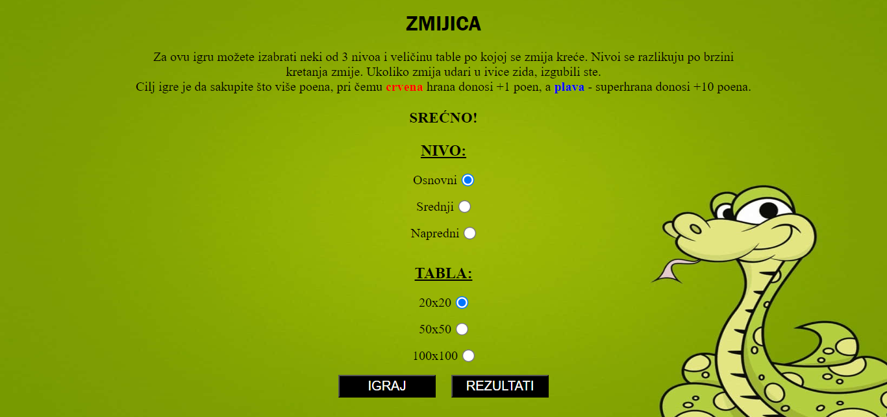

# Snake-Web-Game :video_game:

## Description
This is a classic :snake: game implemented using HTML, CSS, and JavaScript.

Players can choose the size of the game board, and the snake's speed.
The objective is to control the snake, navigate it around the game board, and eat the food to grow while avoiding collisions with the walls and yourself.  

The game keeps track of your score, and you can challenge yourself or your friends to achieve the highest score possible!
